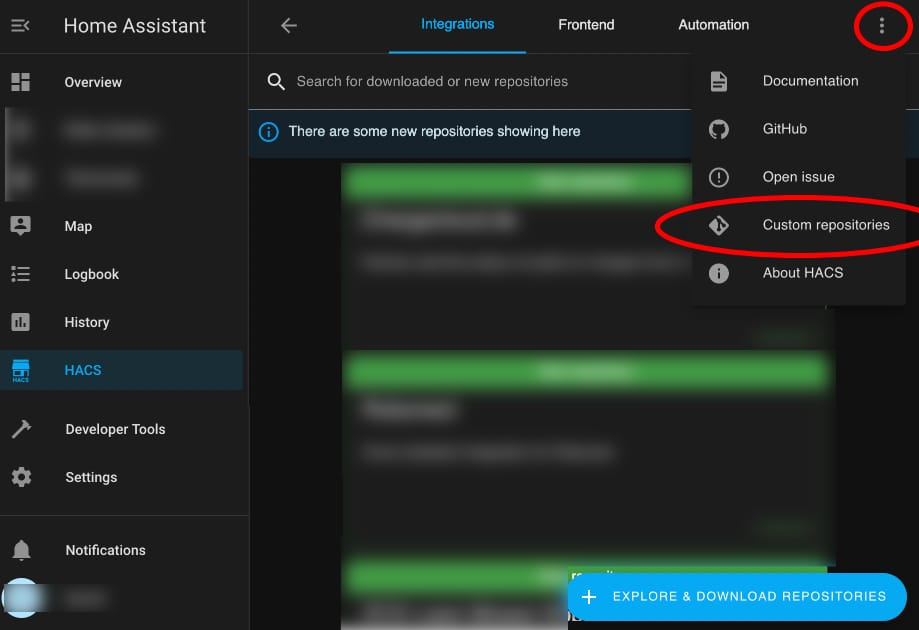
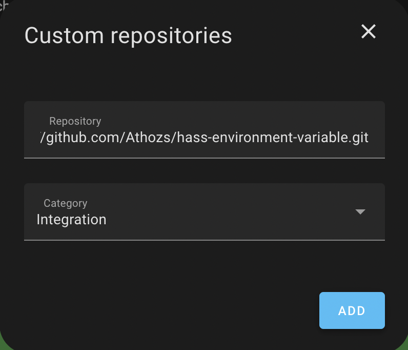

<!-- [](https://github.com/hacs/integration) -->
[](https://github.com/hacs/integration)

# Environment variable for Home Assistant

_Environment Variable_ integration for Home Assistant allows to add environment variable automatically each time Home Assistant is started, even after Home Assistant is updated/upgraded.

This integration is useful for Home Assistant OS (HAOS).

This integration is __useless__ for Home Assistant Docker image and Core installations.

<u>__Variables that are set with this integration won't be available for automations.__</u>

- [Environment variable for Home Assistant](#environment-variable-for-home-assistant)
  - [1. INSTALL WITH HACS](#1-install-with-hacs)
  - [2. INSTALL WITHOUT HACS](#2-install-without-hacs)
    - [2.1. HAOS - Home Assistant Operating System](#21-haos---home-assistant-operating-system)
    - [2.2. Docker and Core](#22-docker-and-core)
  - [3. CONFIGURATION](#3-configuration)
  - [4. HOW DOES _Environment Variable_ WORK ?](#4-how-does-environment-variable-work-)
  - [5. UNINSTALL](#5-uninstall)
  - [6. TROUBLESHOOTING](#6-troubleshooting)
  - [7. KNOWN ISSUES](#7-known-issues)


## 1. INSTALL WITH HACS

<!--
* [Install HACS](https://hacs.xyz/docs/setup/prerequisites) if not already done.
* Then, go to your Home Assistant,
    * -> HACS
    * -> Integrations
    * -> Click _Explore and Download Repositories_
    * -> Search for "Environment Variable"
    * -> From the _Environment Variable_ presentation page: click _Download_
-->


_Environment Variable_ integration may not be available yet from HACS interface, install _Environment Variable_ by adding this Github repository to HACS custom repositories:

* [Install HACS](https://hacs.xyz/docs/setup/prerequisites) if not already done.
* Then, go to your Home Assistant,
    * -> HACS
    * -> Integrations
    * -> Click the Three-dots button in top-right corner
    * -> Custom repositories
    * -> Fill in
      - Repository: https://github.com/Athozs/hass-environment-variable.git
      - Category: Integration
    * -> Click Add

<!--   -->

 


## 2. INSTALL WITHOUT HACS

### 2.1. HAOS - Home Assistant Operating System

* Go to the [Add-on store](https://my.home-assistant.io/redirect/supervisor_store/)
* Install one of the SSH add-ons (you need to enable advanced mode in your user profile to see them)
* Configure the SSH add-on you chose by following the documentation for it
* Start the SSH add-on
* Connect to the SSH add-on
* Download the latest release of _Environment Variable_ from Github (.zip):

```shell
wget https://github.com/Athozs/hass-environment-variable/releases/latest/download/environment_variable.zip
```

* Unzip archive:

```shell
unzip environment_variable.zip
```

* Move or copy folder `environment_variable` into `config/custom_components/` directory:

```shell
cp -r environment_variable config/custom_components/
```


### 2.2. Docker and Core

If you're running Home Assistant core (Python package) directly on host, or running Home Assistant Docker image, you don't need _Environment Variable_ integration. You should set your environment variables from your host OS or Docker Compose file.


## 3. CONFIGURATION

1. Enable _Environment Variable_ integration in `configuration.yaml` and set custom environment variables:

Model:

```yaml
# configuration.yaml
---
default_config:
environment_variable:
  <string>: <string>
  <string>: <string>
  # ...: ...
```

Example:

```yaml
# configuration.yaml
---
default_config:
environment_variable:
  REQUESTS_CA_BUNDLE: /etc/ssl/certs/ca-certificates.crt
  FOOBAR: baz
# ...
```

2. Restart Home Assistant.

3. You may need to reload your integrations after Home Assistant has started to take environment variables into account.

4. Check the logs, look for pattern `environment_variable` in traces (there is not UI for _Environment Variable_).


## 4. HOW DOES _Environment Variable_ WORK ?

When enabled, _Environment Variable_ integration sets environment variables at Home Assistant application level using standard Python lib, meaning environment variables are available only inside Home Assistant Python application/integrations.

Environment variables that are set with this integration won't be available at operating system level.

It loads environment variables only at Home Assistant startup.

There is no control on integrations startup order, you may need to reload your integration after Home Assistant has completely started to take environment variables into account.

For now, _Environment Variable_ won't be visible in Home Assistant integrations dashboard, there is not UI component for _Environment Variable_ integration. This may be possible in future release.


## 5. UNINSTALL

1. Delete _Environment Variable_ from custom components:

```shell
rm -r config/custom_components/environment_variable
```

2. Remove `environment_variable:` config key from `configuration.yaml`:

```yaml
# configuration.yaml
---
default_config:
# environment_variable:
#   FOOBAR: baz
# ...
```

3. Restart Home Assistant.


## 6. TROUBLESHOOTING

You can't check your environment variables using the Shell prompt, because environment variables that are set with this integration are only available at Home Assistant Python application level.

The only way to check environment variable is to access it through Python code inside an integration.

## 7. KNOWN ISSUES

n/a
